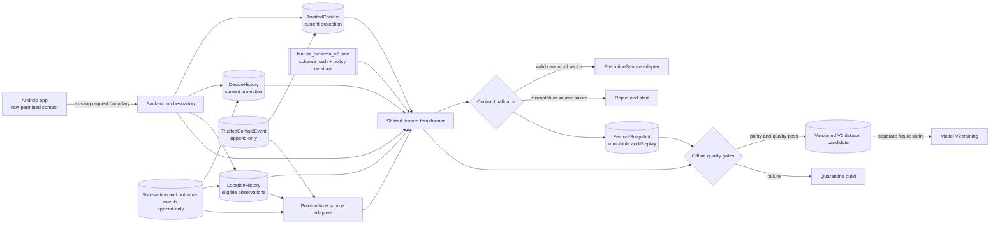
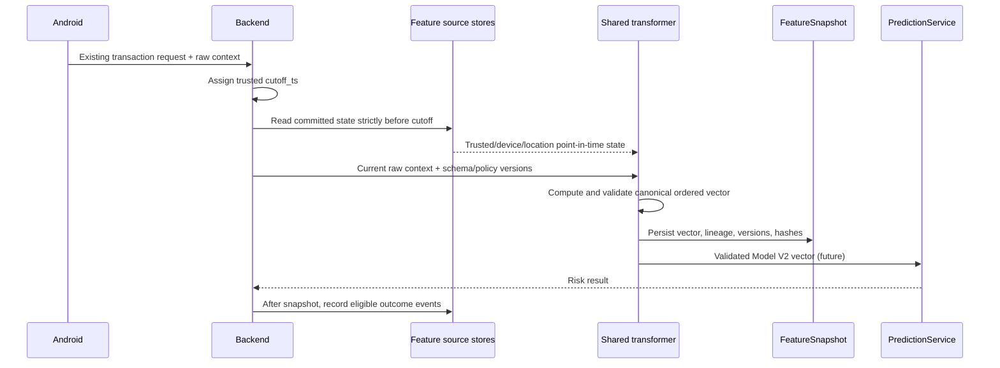
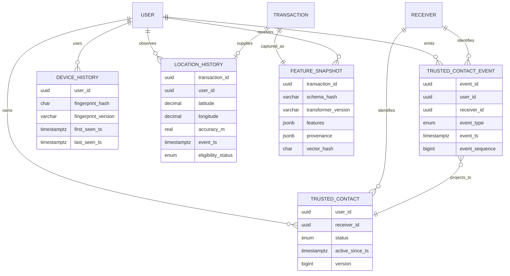
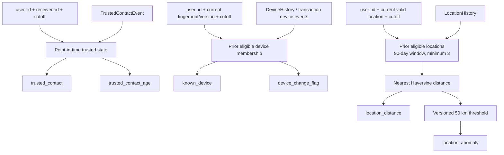
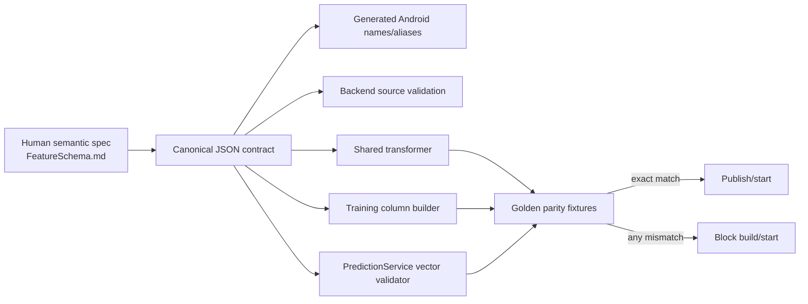

# FORESIGHT Model V2 Dataset Architecture

Implemented ETA-2 components are `shared/contracts/feature_schema_v2.json` and the isolated `backend/feature_infrastructure` package. The diagrams retain future adapters, persistence, and training paths for context; no current endpoint or prediction path is connected to the new package.

## 1. System boundary

Android supplies permitted raw transaction context; authoritative relationship, device-history, and location-history features are resolved by backend-owned state. The current endpoint is unchanged by this architecture sprint.

## 2. Point-in-time sequence

The write-after-snapshot rule prevents the current payment from becoming its own trusted history, known device, or historical location.

## 3. Storage relationships

## 4. Feature lineage

## 5. Contract deployment and quality gates

Required gate identity is the tuple `(schema_hash, transformer_version, device_fingerprint_version, location_policy_version)`. Names alone are insufficient: a formula or policy change with unchanged columns is still incompatible.

## 6. Trust and privacy boundaries

- Android is a signal producer, not the authority for trusted-contact history or prior behavior.
- The backend owns identity resolution, cutoff assignment, source retrieval, validation, and snapshot lineage.
- Raw hardware identifiers are replaced by versioned pseudonymous fingerprints.
- Precise location is consented, encrypted, access-controlled, retention-limited, and omitted from `FeatureSnapshot` provenance.
- Offline builders receive governed point-in-time views, not unrestricted production tables.
- No Model V2 training path exists until real source coverage, mature labels, privacy approval, and parity gates pass.
